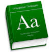
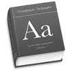

<h3>Simplified Spelling  Written as it sounds. Pronounced as it is written.</h3>

English spelling is notoriously complex and difficult to learn.  English spells its 42 spoken sounds in over 400 ways!  Children spend years memorizing thousands of spelling exceptions in order to learn to read and write.  Those learning English as a second language are hindered by this haphazard system.

Today computers make experimenting with simplified spelling easy.  With this Chrome extension, you can try it with the click of a button on your web browser.

<h3>Instructions</h3>

<strong>Simplified Spelling</strong> can be turned on or off for any webpage
by clicking on the <strong>Simplified Spelling Toolbar Icon</strong>. 
   ON  &nbsp; &nbsp;OFF

You may need to reload the page (under view menu) to see the spelling change.  The extension should be turned off when using web forms such as Gmail. 

The Simplified Spelling Chrome extension may be downloaded from the <a href="https://chrome.google.com/webstore/detail/simplified-spelling/aaacilckajbambkbjbeghcjjobcibnkb">Chrome Webstore</a>, and the code is available at <a href="https://github.com/mark-petersen/SimplifiedSpelling">https://github.com/mark-petersen/SimplifiedSpelling</a>.

<h3>SoundSpel</h3>

This <strong>Simpified Spelling</strong> translator uses the SoundSpel system, which has origins that date back to 1910, and is described in detail in the 1986 publication <a href="http://www.americanliteracy.com/resources/Dictionary_of_Simplified_American_Spelling.pdf">Dictionary of Simplified American Spelling</a>1.  Soundspel is based on very simple, consistent spelling rules:

<ol>
  <li>Short vowels are a single letter, as in: sat, set, did, dot, cut</li>
  <li>Long vowels are followed immediately by an e, as in: sundae, see, die, toe, cue</li>
  <li>No silent letters</li>
  <li>Most double letters are removed</li>
  <li>Consonants such as f, s, j have a consistent, single sound and spelling,  i.e. tough, phone, city, judge, gorgeous&#8594; tuf, foen, sity, juj, gorjus
</ol>

A few other sounds, rules, and exeptions1,2 will be obvious to the reader.  This results in a spelling system with nearly one-to-one correspondence between sounds and spelling.  For example:

<ul>
  <li>hat, have, laugh, plaid  &#8594; hat, hav, laf, plad
  <li>red, head, said, friend &#8594; red, hed, sed, frend
  <li>herd, earth, birth, journey &#8594; herd, erth, berth, jerny
  <li>hide, fight, find, sign, knight &#8594; hied, fiet, fiend, sien, niet
  <li>roll, hole, soul, goal, bowl &#8594; roel, hoel, soel, goel, boel
  <li>tough, love, judge, tongue &#8594; tuf, luv, juj, tung
  <li>knight, receipt, asthma &#8594; niet, reseet, azma
</ul>

This Chrome extension was created by members of the <a href="http://www.americanliteracy.com">American Literacy Council</a>, a non-profit organization founded in 1876.  The American Literacy Council faithfully supports the vision of its founders, who valued any and all methods that could enlarge the circle of English-reading people. We support the founders' vision of gradual, unforced evolution of the written language toward more simple and consistent spellings.

<h3>References</h3>
<ol>
  <li>Rondthaler, Edward and Edward J. Lias, <a href="http://www.americanliteracy.com/resources/Dictionary_of_Simplified_American_Spelling.pdf">Dictionary of Simplified American Spelling</a> New York: The American Language Academy, 1986.
  <li>"SoundSpel", Wikipedia, <a href="https://en.wikipedia.org/wiki/SoundSpel">https://en.wikipedia.org/wiki/SoundSpel</a>
  <li>American Literacy Council, <a href="http://www.americanliteracy.com">http://www.americanliteracy.com</a>
</ol>
